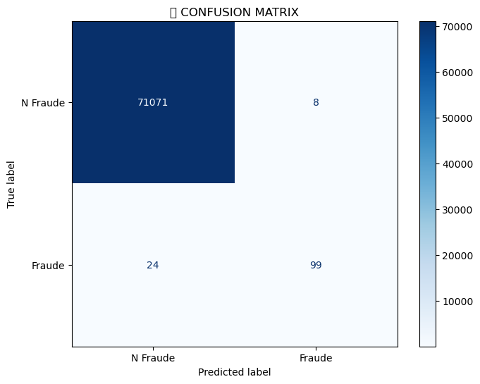
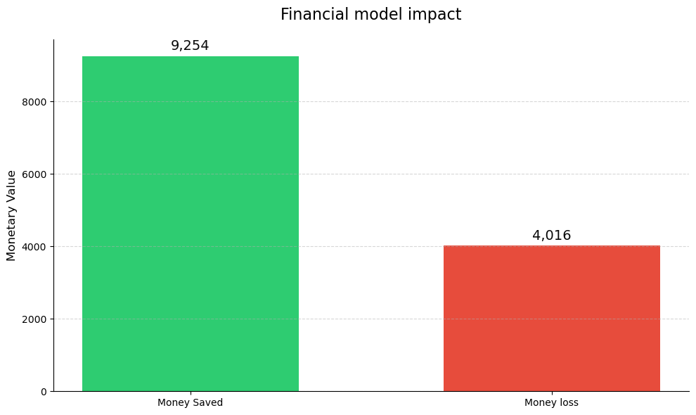

# 🚜 Detecção de Fraudes em transações bancárias (LightGBM + Learning Rate + Class_Weight)

## 📋 Sobre o Projeto
Este projeto resolve um problema muito comum em instituições financeiras: Transações fraudulentas.

O principal desafio foi lidar com dados de **Alta Especificidade** e **Distribuição Assimétrica** (muitas transações normais e pouquissimas de fraudes).

## 🧠 Estratégia de Modelagem

### 1. Algoritmo e Paramêtro
Utilizei o **LightGBM Classifier** com a função objetivo **Learning Rate** (`0.01`) e **Class_Weight** (`balanced`).
* **Por que Learning Rate e Class_Weight?** Por que no caso de análise de fraudes o mais díficil é entender a especifidades dos padrôes fraudulentos, e neste caso, a melhor solução é fazer que o 
modelo se atende a todo e qualquer detalhe no treinamento, fazendo com que o modelo não passe por uma especificidade de fraude sem detecta-lá. Em conjunto com ele, o paramêtro class_weight ajuda muito dizendo para o modelo dar mais enfoque na classe minoritária (aumenta o peso da classe fraude).

### 2. Engenharia de Features
A estrutura de dados foi construída com `Scikit-Learn` incluindo:
* **Escalonamento:** Escalonamento do montante e do tempo para menores escalas.


## 📊 Resultados (Test Validation)

| Métricas | Valor Final |
|----------|-------------|
| **Precision** | **92%** (Assertividade percentual dos apontamentos de fraude) |
| **Recall**    | **81%** (Capacidade de detecção) |
| **F1-Score**  | **86%** (Equilíbrio entre Precision x Recall) |

### Performance: Matrix de Confusão
> *O gráfico de matrix de confusão abaixo mostra como se comportou o modelo durante o teste,
entregando um resultado máximo de **24** fraudes não detectadas*



### Performance Financeira
> *O gráfico de barras abaixo mostra o resultado financeiro do modelo.
Entregando um valor de **$9.000** dolares de prejuizo evitados, que equivalem a **70%** do total das tentativas de fraude*




## 🚀 Como Rodar o Projeto

1. **Clone o repositório:**
   ```bash
   git clone [git@github.com:savioricardog/fraud-detection.git](https://github.com/savioricardog/fraud-detection.git)

2. **Instale as dependências:**
   ```bash 
   pip install -r requirements.txt

3. **Execute o arquivos :**
   ```bash 
   python fraud-detection-V2.py

## 📂 Estrutura de Arquivos 

fraud-detection.py: Estrutura principal de treinamento.

fraud-detection.ipynb: Arquivo em modelo Jupyter.

requirements.txt: Dependências do ambiente.

models/model_fraud_V2.pkl: Modelo treinado.


**Desenvolvido por Savio Ricardo Garcia 👨‍💻**
